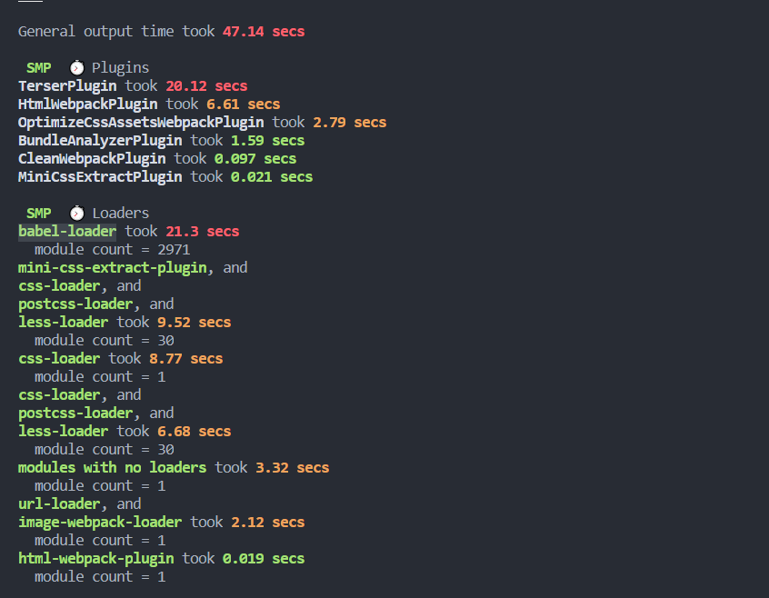
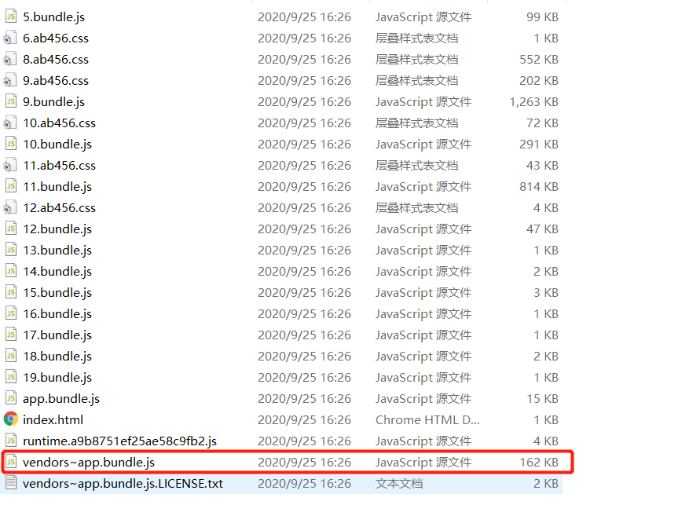

# 从零搭建一个react-hooks项目（五）

- 项目完成大概建起来了，但是当我打个生产包的时候都快哭了，一开始使用的devtool: "source-map"，用时高达 34 s，这当然是不可容忍的
- 然后我们先将devtool改为"none"，然后发现变为了29s


## 分析打包速度

- 通过 `speed-measure-webpack-plugin` 分析 `webpack` 构建期间各个阶段花费的时间，使用方法如下

```js
const SpeedMeasurePlugin = require("speed-measure-webpack-plugin");
const smp = new SpeedMeasurePlugin();
module.exports = smp.wrap(webpackConfig)
```

- 然后在打包时就会显示打包中各阶段花费的时间，显示如下

<!--more-->



## 优化一 优化解析速度 - 多进程打包

- 正常的webpack打包是单线程的，文件只能挨个处理，针对大量文件就会很慢，所以官方推荐了 thread_loader ，这个loader放在其他loader之前，，那么它后面的loader就会在单独的worker进程（node.js process）中进行
- thread_loader使用很简单，将它引入并放到其他loader之前即可
- 注意：thread-loader 需要 style-loader 之后，这是因为 thread-loader 后的 loader 没法存取文件也没法获取 webpack 的选项设置。

```js
module.exports = {
  ...
  module: {
    rules: [
      {
        test: /\.(ts|js)x?$/,
        use: [
          'thread-loader',
          'babel-loader'
        ],
        exclude: /node-modules/
      }
    ]
  }
}
```

- 由于每个worker启动要600ms，为了防止worker启动的高延迟，我们可以进行预热

```js
const threadLoader = require('thread-loader');
const jsWorkerPool = {
  // options
  
  // 产生的 worker 的数量，默认是 (cpu 核心数 - 1)
  // 当 require('os').cpus() 是 undefined 时，则为 1
  workers: 2,
  
  // 闲置时定时删除 worker 进程
  // 默认为 500ms
  // 可以设置为无穷大， 这样在监视模式(--watch)下可以保持 worker 持续存在
  poolTimeout: 2000
};
threadLoader.warmup(jsWorkerPool, ['babel-loader']);

module.exports = {
  ...
  module: {
    rules: [
      {
        test: /\.(ts|js)x?$/,
        use: [
          {
            loader: 'thread-loader',
            options: jsWorkerPool
          },
          'babel-loader'
        ],
        exclude: /node-modules/
      }
    ]
  }
}

```

- 然后我们再尝试打包，分析一下babel-loader的时间


- 我们可以看到优化了将近 9 s

## 优化二 添加公用包的缓存

- 之前我们通过将不会发生变化的三方库进行抽离为dll文件，然后二次打包的时候不再对这些文件进行打包，以此来进行打包优化
- 不过由于webpack的升级，已经有了不差于dll的打包性能，所以我们不再考虑dll形式的打包
- DLL不明显了，但是有了更好的替代品 hard-source-webpack-plugin ，只需要简单引入，之后第一次打包的时候可能会慢一点，但是从第二次开始就可以看到明显的差别
- 使用方法如下
  
```js
const HardSourceWebpackPlugin = require('hard-source-webpack-plugin');

module.exports = {
  ...
  plugins: [
    new HardSourceWebpackPlugin(),
  ],
}
```

- 之后我们再来对比一下，第一次打包


- 可以看到第一次的打包长中HardSourceWebpackPlugin 占了 30多s，几乎跟打包时常一样了
- 但是当我们第二次打包的时候


- 这时神奇的事发生了，我们的打包时间变得只有13s了，缩短了60%

## 优化三 vendor代码分离

- 我们发现打出来的三方库的包vendor只有一个，体积达到了 2.6 M，这样对我们的首次加载是极其不友好的


- 所以我们需要对其进行优化，在webpack的代码分割配置中，我们修改配置如下

```js
module.exports = {
  ...
  optimization: { // 公共代码抽离
    runtimeChunk: 'single',
    splitChunks:{ //启动代码分割，有默认配置项
      chunks: 'all',
      maxInitialRequests: Infinity,
      minSize: 0,
      cacheGroups: {
        vendor: {
          test: /[\\/]node_modules[\\/]/,
          name(module) {
            const packageName = module.context.match(/[\\/]node_modules[\\/](.*?)([\\/]|$)/)[1];
            return `npm.${packageName.replace('@', '')}`;
          },
        },
      },
    }
  }
}

```

- 然后再执行我们的打包命令，就可以发现，之前只有一个vendor变成很多个对应的npm包的vendor了



- 这样的话我们首屏的加载速度也会有一个明显的提升
