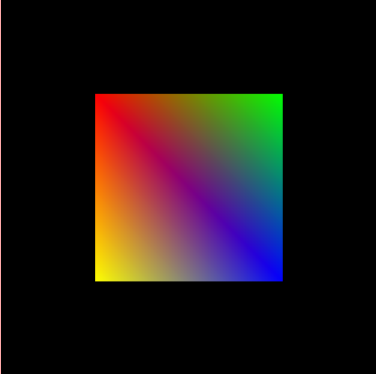

# 初识webGl

- webGl是在web端实现3d效果的Api，是OpenGl的裁剪版，适用于web端的3d效果实现
- webGl在浏览器端的支持情况不一致，所以我们使用时注意兼容此种情况

## 着色器

- 在使用webGl的时候我们要准备两个着色器，
- 一个顶点着色器，用来确定我们的渲染物体的各个顶点的位置，由这些顶点可以确定画面的渲染位置
- 一个片段着色器，用来确定顶点决定的图形的各个像素的颜色值
- 下面我们分别定义这两个着色器

```js
// 顶点着色器
precision lowp float; // 指定一下我们着色器的数据精度
attribute vec4 inColor; // 定义一个包含4个浮点数的浮点型向量，一个属性值，将会从缓冲中获取数据，用于颜色值
attribute vec3 v3Position; // 定义一个包含3个浮点数的浮点型向量，一个属性值，将会从缓冲中获取数据，用于表示该顶点的位置
varying vec4 outColor; // 可变量，是顶点着色器向片段着色器传值的方式
void main() {
  outColor = inColor; // 将获取到的顶点的值赋给可变量从而传递给片段着色器
  gl_Position = vec4(v3Position, 1.0); // gl_Position是webgl提供的内置变量，用来表示顶点位置
}

// 片段着色器
precision lowp float; // 指定一下我们着色器的数据精度
varying vec4 outColor; // 可变量，获取顶点着色器的传值
void main() {
  gl_FragColor = outColor; // gl_fragColor也是webgl提供的内置变量，用来表示像素点的颜色
}

```
<!--more-->
## 第一个实例

- 接下来我们就用一个实例来看看wenGl的编写过程
- 首先我们需要准备一个canvas作为webGl的宿主环境

```js
<canvas id="canvas" width='500' height='500'></canvas>
```

- 然后开始我买的呢js代码实现，首先我们获取创建的canvas的Dom元素
- 然后获取webGl的运行环境

```js
// 定义着色器语句
let shaderVsJs = `
precision lowp float;  
attribute vec3 v3Position;
attribute vec4 inColor;
varying   vec4 outColor;
void main(){
  outColor = inColor;
  gl_Position = vec4(v3Position, 1.0);
}
`
let shaderFsJs = `
precision lowp float;
varying vec4 outColor;
void main(){
  gl_FragColor = outColor;
}
`
// 获取canvas环境
let canvas = document.querySelector('#canvas')
webgl = canvas.getContext('webgl')
if(!webgl) {
  alert('浏览器暂不支持webGl，请更换浏览器')
  return
}
```

- 接着设置webgl的视口大小，这个视口需要在canvas的范围内，所以我们先设为整个canvas的大小

```js
// 视口的设置参数为 左上角顶点位置x，左上角顶点位置y，视口的宽度，视口的高度
webgl.viewport(0, 0, canvas.clientWidth, canvas.clientHeight)
```

- 接着需要创建我们顶点着色器与片段着色器

```js
// 着色器的创建函数以及错误警告
function initShaderSouce(webgl, shader, shaderScript){
  webgl.shaderSource(shader, shaderScript)  // 提供数据源
  webgl.compileShader(shader) // 编译，生成着色器
  const success = webgl.getShaderParameter(shader, webgl.COMPILE_STATUS) // 查看着色器的编译状态
  if(success) {
    return shader
  }
  console.log(webgl.getShaderInfoLog(shader)) // 出错时打印着色器的出错日志
  webgl.deleteShader(shader) // 着色器失败时删除对应着色器
}

const ertexShaderObject = webgl.createShader(webgl.VERTEX_SHADER) // 创建着色器对象
const fragmentShaderObject = webgl.createShader(webgl.FRAGMENT_SHADER)  

initShaderSouce(webgl, vertexShaderObject, shaderVsJs)
initShaderSouce(webgl, fragmentShaderObject, shaderFsJs)
```

- 然后就要创建我们的着色程序，然后把着色器也要链接到着色程序以让他们生效
- 然后将我们在着色器语句中创建的两个attribute变量v3Position关联到我们的属性索引

```js
let inColorIndex = 1, v3PositionIndex = 0 // 创建对应的属性索引
programObject = webgl.createProgram() // 创建着色程序

webgl.attachShader(programObject, vertexShaderObject)   // 将着色器附加到着色程序中
webgl.attachShader(programObject, fragmentShaderObject)

webgl.bindAttribLocation(programObject, inColor, 'inColor') // 将着色器中的变量（必须是attribute变量）关联到一个属性索引
webgl.bindAttribLocation(programObject, v3PositionIndex, 'v3Position') 

webgl.linkProgram(programObject) // 链接我们的着色程序
if(!webgl.getProgramParameter(programObject, webgl.LINK_STATUS)) { // 查看着色程序是否正确链接
  console.log(webgl.getProgramInfoLog(programObject)) // 链接失败打印打印错误信息
  return
}
webgl.useProgram(programObject) // 启用我们的链接程序
```

- 接下来我们就要创建我们的顶点数据与索引数据了
- 顶点数据确定了我们所有的可能使用的顶点的元素的集合
- 索引数据确定了我们顶点的绘制顺序的集合
- 数据集合都以buffer（缓冲）的形式保存，所以需要创建对应的缓冲变量

```js
// 顶点数据集合
let triangleArrayData = [
  // 每一行的前三个数据为顶点位置， 后4个位置为对应的颜色 rgba 值，所以一个顶点对应7个数据
  // x,  y,   z,   r,   g,   b,  a
  -0.5, 0.5, 0.0, 1.0, 0.0, 0.0, 1.0, // 左上
  0.5, 0.5, 0.0, 0.0, 1.0, 0.0, 1.0, // 右上
  0.5, -0.5, 0.0, 0.0, 0.0, 1.0, 1.0, // 右下
  -0.5, -0.5, 0.0, 1.0, 1.0, 0.0, 1.0 // 左下
// 索引数据集合
let indexArrayData = [
  0, 1, 2,
  0, 2, 3
]

const triangleBuffer = webgl.createBuffer() // 缓冲区创建
const indexBuffer = webgl.createBuffer()

```

- 然后将创建的存储区设置为对应存储区类型的操作对象 （也就是说绑定了这个存储区类型要用来操作这个缓冲区了）
- 然后给这个缓冲区确定数据、数据类型与数据的变动状况

```js
// 绑定ARRAY_BUFFER存储区类型操作 triangleBuffer
webgl.bindBuffer(webgl.ARRAY_BUFFER, triangleBuffer)  
// 给缓冲区绑定数据与确定数据的变动情况  Float32Array 表示32位浮点数， webgl.STATIC_DRAW表示这个数据我以后不会经常改
webgl.bufferData(webgl.ARRAY_BUFFER, new Float32Array(triangleArrayData), webgl.STATIC_DRAW) //

webgl.bindBuffer(webgl.ELEMENT_ARRAY_BUFFER, indexBuffer)
webgl.bufferData(webgl.ELEMENT_ARRAY_BUFFER, new Uint16Array(indexArrayData), webgl.STATIC_DRAW)
```

- 然后准备清空我们的画布开始绘制我们的图形

```js
// 清空画布的颜色 
webgl.clearColor(0.0, 0.0, 0.0, 1.0)
// 执行清空操作
webgl.clear(webgl.COLOR_BUFFER_BIT) 
```

- 然后我们启用之前绑定的变量索引，方便在后续更改变量值进行绘画

```js
webgl.enableVertexAttribArray(v3PositionIndex) // 启用对应关联索引上的数组数据或元素数组数据
webgl.enableVertexAttribArray(inColor)
```

- 然后为我们的变量索引分配数据

```js
// 为变量分配数据，参数对应为  第一个：数据绑定的变量， 第二个参数表示需要的元素个数（3表示需要3个数据，4表示需要4个数据，与定义时的 vec 后面跟的3或4相关），
// 第三个参数为元素的数据类型， 第四个参数为是否归一化， 第五个参数为第二个数据与上一个数据的偏移量，以字节为单位（这里因为我们定义的是Float32位，所以一个数据为4个字节，偏移量就是每一组数据的个数7 * 字节数4），第六个参数是数据的偏移量（前三个数据为顶点的坐标位置，后4个为顶点的rgba值）
webgl.vertexAttribPointer(v3PositionIndex, 3, webgl.FLOAT, false, 7 * 4, 0) // 位置需要3个值， 第一行第一个开始就是要用的数据了，所以偏移量为0
webgl.vertexAttribPointer(inColor, 4, webgl.FLOAT, false, 7 * 4, 3 * 4)  // 位置需要4个值， 第一行第4个开始才是要用的数据了，所以偏移量为数据个数 3 * 字节数 4
```

- 之后我们的全部流程就完成了，然后再执行我们的绘画操作就可以了

```js
// 绘制方法，第一个参数表示我们要画三角形， 第二个表示我们的顶点的绘制顺序总共有几个，第三个表示顶点绘制顺序的数据的元素类型是短整型，第四个参数是表示从数据列表的第几个开始绘制
webgl.drawElements(webgl.TRIANGLES, 6, webgl.UNSIGNED_SHORT, 0)
```

- 之后我们就绘制了出了一个渐变色正方形

